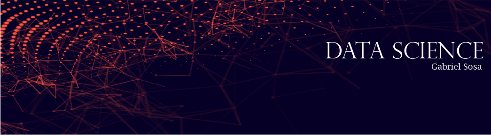

   

  

#  Proyectos
* **Observaciones al naufrágio del Titanic:** https://bit.ly/pe_titanic

---
#  Import Blogs as blg
* **Gabriel Sosa:** https://bit.ly/gabososa
* **Escuela de Datos Vivos:** https://bit.ly/eddvblog
* **Sigmoidal:** https://bit.ly/sigmoidalai
* **Data Hackers:** https://bit.ly/datahackerbr
* **Towards Data Science** https://bit.ly/towardsds
